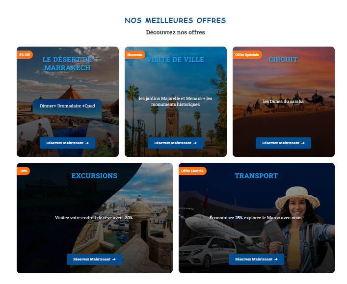

# 🚗 PremiumKechTours

**PremiumKechTours** is a modern, responsive and multilingual tourism and car rental website based in Marrakech. It offers a seamless user experience for booking excursions, private transport, and activities across Morocco.

---

## 🌍 Features

- 🌐 **Multilingual Support** (English / French)
- 🏝️ **Excursions & Activities** management
- 🚗 **Luxury Car Rentals**
- 📆 **Booking System** with inquiry forms
- 📷 **Image Sliders** for tours and cars
- 🎨 Fully responsive UI with Tailwind CSS + Bootstrap
- 🧠 SEO-ready content structure
- 💬 WhatsApp integration for instant contact

---

## 🎥 Demo Video

Check out a walkthrough of the platform in action:

> ⚠️ **Note**: Due to GitHub limitations, large video files (MP4) stored with Git LFS cannot be played directly. Please download or upload them to YouTube/Vimeo for better viewing.

📥 [Download Desktop Demo (MP4)](PKtours_Desktop.mp4)  
📥 [Download Mobile Demo (MP4)](PKtours_Mobile.mp4)

---

## 📸 Screenshots

| Footer Page | Offers | Transport |
|-------------|--------|-----------|
|  |  |  |

---

## 🛠️ Tech Stack

- **Backend**: Laravel (PHP 8+) + MySQL
- **Frontend**: HTML5, Bootstrap, JavaScript
- **Tools**: AOS (Animate On Scroll), Git LFS for large files

---

## 📁 Project Structure

```
premiumkechtours/
├── app/
│   ├── Http/
│   │   └── Controllers/
│   ├── Models/
├── public/
│   ├── assets/
│   │   ├── images/
│   │   └── css/
├── resources/
│   ├── views/
│   └── lang/
├── routes/
│   └── web.php
├── storage/
├── .env.example
├── composer.json
└── README.md
```

---

## 🚀 Getting Started

### 1. Clone the repository

```bash
git clone https://github.com/yourusername/premiumkechtours.git
cd premiumkechtours
```

### 2. Install dependencies

```bash
composer install
npm install && npm run dev
```

### 3. Set up environment

```bash
cp .env.example .env
php artisan key:generate
```

### 4. Configure database and run migrations

Edit `.env` with your DB credentials, then run:

```bash
php artisan migrate
```

### 5. Serve the app

```bash
php artisan serve
```

Visit `http://127.0.0.1:8000` in your browser.

---

## ✨ Customization

You can customize:

- Translations: `resources/lang/`
- Styles: `public/assets/css/`
- Images: `public/assets/images/`
- Routes & Logic: `routes/web.php`, `app/Http/Controllers/`

---

## 📬 Contact

**Developed by [Rochdi](mailto:rochdi.karouali1234@gmail.com)**  
📧 Email: rochdi.karouali1234@gmail.com  
---

## 💖 Credits

- Icons by [FontAwesome](https://fontawesome.com/)
---

## 📄 License

This project is licensed for educational and freelance use. Contact me for commercial licenses.

---
